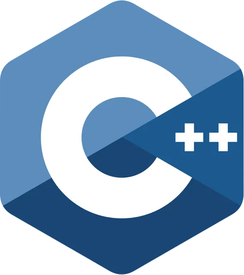

<!-- Titulos -->
# Mi titulo
## Mi titulo 2
### Mi Titulo 3
#### Mi Titulo 4
##### Mi Titulo 5

<!--Tipos de texto--->
Texto en *italic*

Texto en **Negrita**

Texto en ~~tachado~~


<!-- Tipos de lista -->
* Camisa
    * Camisa negra
    * Camisa azul
* Zapatos
    * Zapatos negros
    * Zapatos tenis
* Pantalon

1. Camisa
    1. Camisa negra
    2. Camisa Azul
2. Zapato
3. Pantalon 

<!--Enlaces-->
[Google](https://www.google.com "google enlace")

<!--Cintas-->
>Esta es una cinta

<!--Lineas divisorias-->
---
---

<!--Colocando codigo-->

`console.log("Para una linea de codigo")`

```javascript
//Escrivimos el tipo de codigo que esta escriviendo
for(int i=8;i=8;++i){
    console.log("numero",i);
}

```

```c++
int x=8
for(int i=8;i=x;++i){
    cout<<"numero"+ i;
}
```

```html
<!DOCTYPE html>
<html>
<head>
    <title>My HTML Page</title>
</head>
<body>
    <h1>Hello, World!</h1>
    <p>This is a sample HTML page.</p>
</body>
</html>
```

<!--Generando una tabla --->
| Nombre  | Edad | Ciudad    |
|---------|------|-----------|
| Gabriel | 25   | New York  |
| Maria   | 30   | Barcelona |
| John    | 35   | London    |

<!--Llamando una imagen --->





<!--Implementaciones en github -->
<!--Este codigo solo funciona en el repositorio de git hub con el nombre del archivo README.md -->

<!--Listas-->
* [x] Tarea 1
* [ ] Tarea 2
* [ ] Tarea 3
* [x] Tarea 4

<!-- Emojis -->
[Link emojis](https://gist.github.com/rxaviers/7360908 "Github emojis")

Usando un emoji :+1: 
Usando un emoji :smile:

<!--Mencionar a una persona -->
@argabriel20
@argabriel_2000

[Lista de comandos Markdown por GitHub](https://github.com/adam-p/markdown-here/wiki/Markdown-Cheatsheet "Comandos markdown")
